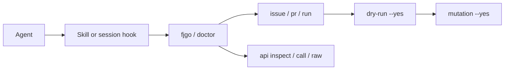

<p align="center">
  
</p>

<h1 align="center">fjgo</h1>

<p align="center">
  Agent-first Forgejo CLI for coding agents.
</p>

<p align="center">
  <a href="https://github.com/astrazds/fjgo/blob/main/LICENSE"></a>
  <a href="https://www.npmjs.com/package/@astrazds/fjgo"></a>
</p>

`fjgo` gives coding agents a safe, compact way to work with [Forgejo](https://forgejo.org/) repositories. It covers issues, pull requests, Actions, releases, labels, secrets, and the rest of the bundled Forgejo API, with TOON stdout, structured errors, and token-safe dry runs.

Use normal `git` for commits, branches, and local files. Use `fjgo` for work that needs the Forgejo server.

```text
$ npx -y @astrazds/fjgo -R origin issue list --state open
count: 3 of 3 total
issues[3]{number,title,state}:
  12,Redact API diagnostics,open
  9,Separate watch timeout,closed
  4,Publish wiki manual,closed
help[1]{command}:
  Run `fjgo issue view 12` to see full details
```

## Why fjgo?

An agent can call the Forgejo API with `curl`, but it has to remember URLs, JSON shapes, and authentication rules. That creates extra work and makes mistakes more likely.

`fjgo` keeps the expensive parts in one tool:

- short commands for common Forgejo jobs;
- compact TOON output that uses fewer tokens;
- structured errors and focused `--help`;
- `--dry-run` / `--print-request` before writes;
- token, password, and OTP values kept out of stdout;
- generated coverage of every operation in the pinned Forgejo Swagger.

## Install

The public npm package is `@astrazds/fjgo` because unscoped `fjgo` is blocked on the npm registry. The command name remains `fjgo`. Node.js 20 or newer is required, on Linux or macOS with an x64 or arm64 CPU.

### Agent Skill

```sh
npx skills add https://github.com/astrazds/fjgo.git --skill fjgo -g
```

That is the full setup. You do not need to clone this repository or run `npm install`. The skill runs the CLI through `npx -y @astrazds/fjgo`. The first run downloads the matching native release, verifies its checksum, and caches it.

### Native archive

```sh
curl -LO https://github.com/astrazds/fjgo/releases/download/v1.4.3/fjgo_v1.4.3_linux_amd64.tar.gz
tar -xzf fjgo_v1.4.3_linux_amd64.tar.gz
install -Dm755 fjgo_v1.4.3_linux_amd64/fjgo ~/.local/bin/fjgo
```

Use `darwin` instead of `linux`, and `arm64` instead of `amd64`, when that matches the machine. Then run `fjgo` directly.

### Optional ambient hooks

The skill and the native binary are enough for on-demand use. If you want Forgejo context at the start of every agent session:

```sh
npx -y @astrazds/fjgo setup hooks --check
npx -y @astrazds/fjgo setup hooks
```

You only need the skill or the hooks. Installing both is fine.

### Codex plugin

This repository is also a validated Codex plugin package. A marketplace can point at the repository root to distribute the existing skill with branding and starter prompts. Until a marketplace lists it, the Agent Skill command above remains the shortest public path. See [Codex plugin](https://github.com/astrazds/fjgo/blob/main/docs/codex-plugin.md).

## Use

Set the Forgejo host. Add a token for private repos or writes. Do not paste the token into an agent prompt.

```sh
export FJGO_HOST=forgejo.example.com
export FJGO_TOKEN=your_access_token
```

1. Orient inside a checkout whose Forgejo remote is `origin`: `npx -y @astrazds/fjgo -R origin`
2. Inspect work with `doctor`, `issue list`, `pr list`, and `run list`.
3. Preview a write with `--dry-run --yes`. Apply it by dropping `--dry-run`.



`-R origin` reads `OWNER/REPO` from the Git remote. You can also pass `--repo OWNER/REPO` or `FJGO_REPO`. Every command has focused `--help`.

```sh
npx -y @astrazds/fjgo -R origin issue list --state open
npx -y @astrazds/fjgo -R origin pr checks 12
npx -y @astrazds/fjgo issue create --title "Fix the login page" --dry-run --yes
```

## Privacy

`fjgo` has no backend, analytics, advertising, or telemetry. It does not store Forgejo credentials. Host and token come from the environment or flags on this machine.

| Location | Purpose |
| --- | --- |
| `FJGO_TOKEN` / `--token` | User-supplied access token; never written by fjgo |
| `doctor` / `auth status` | Show whether credentials are present, not their values |
| `--dry-run` / `--print-request` | Token-safe request previews |
| npm launcher cache | Checksum-verified native binary only |

See [PRIVACY.md](https://github.com/astrazds/fjgo/blob/main/PRIVACY.md) for the complete data boundary.

## Limitations

- Linux and macOS on x64 or arm64. The npm launcher does not support Windows.
- Forgejo only. It is not a GitHub or GitLab client.
- Mutating commands require `--yes`. There are no interactive prompts.
- Codex marketplace publication is separate from fjgo releases.
- Ambient `FJGO_TOKEN` is ignored on the public demo API unless the host or base URL is set explicitly.

## This repository

Source, issues, and CI live on GitHub at https://github.com/astrazds/fjgo.
Do not run `fjgo -R origin` in this clone. `origin` is GitHub. Use `gh` for this repo's issues. Use fjgo against a Forgejo host with `--host` and `--repo`.

## Project structure

| Path | Purpose |
| --- | --- |
| `cmd/fjgo/` | CLI parsing, AXI output, curated commands, hooks |
| `internal/forgejo/` | HTTP client and generated Swagger methods/models |
| `internal/fjgoskill/` | Embedded skill and installer |
| `internal/benchmark/` | Offline agent-job catalog and baseline |
| `skills/fjgo/` | Public Agent Skill invoked through `npx -y @astrazds/fjgo` |
| `docs/` | CLI reference, plugin, development, and wiki sources |
| `scripts/verify.sh` | Local and CI verification gate |

The [wiki manual](https://github.com/astrazds/fjgo/blob/main/docs/wiki/Home.md) is the short operator guide. [CLI reference](https://github.com/astrazds/fjgo/blob/main/docs/cli-reference.md) covers authentication, output, command groups, and the generic API escape hatch.

## Development

Go 1.26 and Node.js 20 or newer are required.

```sh
npm ci
./scripts/verify.sh
go run ./cmd/fjgo-benchmark
```

CI on `main` is `.github/workflows/verify.yml`. Open the [Actions log](https://github.com/astrazds/fjgo/actions/workflows/verify.yml) for recent runs. Tag `v*` releases build archives, publish the GitHub release from `CHANGELOG.md`, and publish `@astrazds/fjgo`. See [Development](https://github.com/astrazds/fjgo/blob/main/docs/development.md).

Contributions are welcome; read [CONTRIBUTING.md](https://github.com/astrazds/fjgo/blob/main/CONTRIBUTING.md) before opening a pull request. Security reports use [SECURITY.md](https://github.com/astrazds/fjgo/blob/main/SECURITY.md). fjgo is licensed under [MIT](https://github.com/astrazds/fjgo/blob/main/LICENSE).
